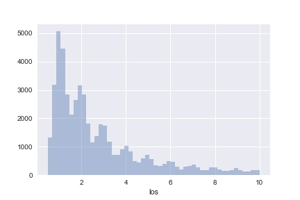

# LOS Prediction on ICU patients on the MIMIC database using RNNs

## Abstract
Length of Stay (LOS) of Intensive Care Unit (ICU) patients is a critical metric which hospitals around the world use to measure patient care. Given high cost of treating ICU patients, hospitals need to measure LOS in order to ensure optimized allocation of scare bed spaces in the ICU ward. ICU patients are monitored more closely than other patients and their vitals are measured more frequently. Given the sequential, timeseries nature of healthcare data, the sequential model of RNNs was chosen for this application. Given the futility of predicting the LOS at the end of the patient's stay, this project predicted the number of remaining days of stay at every RNN hidden state. We achieved a model with 95% accuracy at predicting number of remaining days left.

## Tools & libraries

- pandas
- numpy
- keras 1.2 with TensorFlow backend
- matplotlib, seaborn for plotting

## Data extraction and cleaning

### MIMIC
MIMIC is a publically available, for research database, of more than 60k ICU patient records. The database contains admission details as well granular details regarding every measurement and medication for the patient. The database is completely annonymised to ensure patient privacy is protected. Access to MIMIC is restricted barring some basic HCP tests. More details available here.

### Data download
For the purpose of this project and to fit the scope, we restricted this study to 10000 **adult (ages 14-89)** patients only. The cohort was further reduced to only those patients who have atleast one of the following 12 vitals measured in the database:
- Heart Rate
- Arterial BP [Systolic]
- Arterial BP [Diastolic]
- Capillary Refill
- ETCO2
- FIO2
- GCS Total
- Blood Glucose 
- O2 saturation pulseoxymetry
- Temperature F
- Arterial pH
- Respiratory Rate

Furthermore, the dataset was restricted to patients who's LOS was a minimum of 1 day and a maximum of 10 days. The resulting dataset had 7018 patients. The histogram below shows the distribution of the LOS of the patients in the database.

### Data cleaning
For this study, we restricted our feature set to 12 vitals collected over the patients stay along with the patient's age in years. It is important to note that not all vitals were measured equally frequently, except for age which is a static measurement. Each feature was cleaned to remove obvious mistaken entries by putting in some common sense min and max thresholds. All features were normalized using a MinMax scaler. 

### Data aggregation
As each feature was collected at different time intervals and frequencies, we aggregated them to take the average value every 12 hours. We chose 12 hours as it was expected that the patient would be monitored at least twice a day to understand the remaining LOS based on their vitals. This aggregation was achieved by using the pivot table functionality from pandas. 

## Model construction

### Input layer
Each patient's data was padded at the end with zero arrays to ensure all of them have the same shape. Each input array was a 10 long vector of the given patient's vitals at that timestep. 

### Model  
The model chosen was a Bidirectional LSTM with a Time Distributed output layer. Each input into the LSTM will correspond to each timestep on the patients stay. Each LSTM will have 21 units. The dropout on the LSTM layer was set to 0.1.

### Output layer
The output vector for the padded space was directed to a dummy variable called 11 (outside the 10 day max limit). The output layer was TimeDistributed so we will be trying to predict the remaining number of days of LOS at every timestep. 

## Training
The train-test split was 90-10. The batch size was set to 20 and the model was trained for 5 epochs only. 

## Results

The model achieved an **overall accuracy of 95%** with only 5 epochs of training time. Given the small dataset, training longer than this resulted in overfitting on the train set. The **average precision and recall across all the classes was 85%**. The confusion matrix in the image below shows that model does fairly well at predicting across the classes. 

